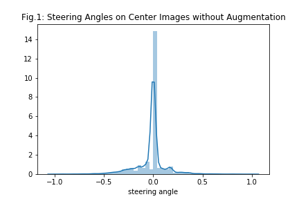

# Behavioral Cloning Project #
[](http://www.udacity.com/drive)

## Background/ Purpose of the project ##
* Use the simulator to collect data of good driving behavior
* Build, a convolution neural network in Keras that predicts steering angles from images
* Train and validate the model with a training and validation set
* Test that the model successfully drives around track one without leaving the road

### Main files ###
* model.py The script that defined the CNN model used in this project
* drive.py for The script to drive the car in autonomous mode
* ./saved_models/model-038.h5 The model weights
* ./data/results.mp4 Video of the car in autonomous mode of track one
* This README as a summary report

### How to Run ###
#### Dependencies ####
- OS: Ubuntu (tested on Ubuntu 19.04)
- python: 3.6
- Run the following command to install python dependencies
```bash
python3 -m pip install -r requirements.txt
```

#### How to drive in autonmous mode ####
```bash
python3 drive.py
# path to the model is already provided inside the script
```

#### How to train ####
Train samples are provided in [train.py](./train.py) and [train.ipynb](./notebooks/train.ipynb) notebook

### Model Architecture ###
The model deployed in this project is built base on the [NVIDIA end-to-end steering angle prediction model](https://arxiv.org/pdf/1604.07316.pdf) with modification that fits the data obtained from the simulator through training experiments. The input images are normalized to the range of [-0.5, 0.5] to make gradient works better. The model includes ELU activation layers after each convolution layers and fully connected layers to introduce nonlinearity. A dropout layer of 0.5 dropout rate was added after convolution layers to reduce overfitting. The top and bottom parts that include sky and car fronts area are cropped from the images, as they do not contribute to predict the behavior of the car.

The final model architecture consisted of one cropping layer, followed by a lambda layer to normalize the image. The model also consisted of 5 convolution layers (3 convolution layers of 5x5 filter size and 2 convolution layers of 3x3 filter size) and 4 fully connected layers:
- Cropping2D
- Image Normalization
- Convolution Layer 1: 5x5 with 24 filters, ELU activation
- Convolution Layer 2: 5x5 with 36 filters, ELU activation
- Convolution Layer 3: 5x5 with 48 filters, ELU activation
- Convolution Layer 4: 3x3 with 64 filters, ELU activation
- Convolution Layer 5: 3x3 with 64 filters, ELU activation
- Dropout(0.5)
- Flatten
- FC layer 1: 100, ELU activation
- FC layer 2: 50, ELU activation
- FC layer 3: 10, ELU activation
- FC layer 4: 1 (Output)

The details about the number of params can be seen in the following chart.

```bash
Layer (type)                 Output Shape              Param #   
=================================================================
input_1 (InputLayer)         [(None, 160, 320, 3)]     0         
_________________________________________________________________
cropping2d (Cropping2D)      (None, 65, 320, 3)        0         
_________________________________________________________________
lambda (Lambda)              (None, 65, 320, 3)        0         
_________________________________________________________________
conv2d (Conv2D)              (None, 31, 158, 24)       1824      
_________________________________________________________________
elu (ELU)                    (None, 31, 158, 24)       0         
_________________________________________________________________
conv2d_1 (Conv2D)            (None, 14, 77, 36)        21636     
_________________________________________________________________
elu_1 (ELU)                  (None, 14, 77, 36)        0         
_________________________________________________________________
conv2d_2 (Conv2D)            (None, 5, 37, 48)         43248     
_________________________________________________________________
elu_2 (ELU)                  (None, 5, 37, 48)         0         
_________________________________________________________________
conv2d_3 (Conv2D)            (None, 3, 35, 64)         27712     
_________________________________________________________________
elu_3 (ELU)                  (None, 3, 35, 64)         0         
_________________________________________________________________
conv2d_4 (Conv2D)            (None, 1, 33, 64)         36928     
_________________________________________________________________
elu_4 (ELU)                  (None, 1, 33, 64)         0         
_________________________________________________________________
dropout (Dropout)            (None, 1, 33, 64)         0         
_________________________________________________________________
flatten (Flatten)            (None, 2112)              0         
_________________________________________________________________
dense (Dense)                (None, 100)               211300    
_________________________________________________________________
elu_5 (ELU)                  (None, 100)               0         
_________________________________________________________________
dense_1 (Dense)              (None, 50)                5050      
_________________________________________________________________
elu_6 (ELU)                  (None, 50)                0         
_________________________________________________________________
dense_2 (Dense)              (None, 10)                510       
_________________________________________________________________
elu_7 (ELU)                  (None, 10)                0         
_________________________________________________________________
dense_3 (Dense)              (None, 1)                 11
=================================================================
```
### Data Aquisition and Preprocessing ###
Initially I only used the data provided by Udacity for training, but after testing the trained model, I realized that the car easily moved out of the road at the corner; so I decided to record more data of car driven at the winding corner and merged all the data together to get a new dataset. Nonetheless, the majority of center images have steering angles of around 0 as can be seen in the following distribution figure:



Besides the cropping and image normalization that are stated above, I also tried resizing the image to size 66x200 and converted the image to YUV format as stated in the NVidia model paper; but later found out that the 2 processing procedures did not improve the model (in terms of val loss) so I decided not to include resizing and YUV color space to the final model.

### Data Augmentation ###
- Randomly choosing center, left or right images with steering angle offset of +0.4 and -0.4 for left and right images respectively to fix the unbalance of the dataset on zero steering angle.
- Randomly flipping images horizontally
- Using [albumentations](https://github.com/albumentations-team/albumentations) image augmentation library to add random brightness, contrast and shadow effect to the image
- Using [Cutout](https://arxiv.org/pdf/1708.04552.pdf) that randomly masking out square regions of the images.

I splitted the original dataset to 80% for training and 20% for validation. The data augmentation processes are applied randomly on the train image on each new epoch to get 6 times more data of the original train set.

### Hyperparameter ###
- optimizer : I used Adam optimizer for optimization with the learning rate of 0.0001
- loss function: I used MSE loss to measure the discrepancy of the given steering angle and prediction value for each image.
- callbacks: I used ModelCheckpoint to save the best weights of each epoch; ReduceLROnPlateau to reduce the learning rate when val loss stops decreasing. I also used EarlyStopping that monitors val loss. I set the number of epoch to 100; but with EarlyStopping the training stopped sooner.
- batch size: I chose a small batch size of 64 to obtain better accuracy performance

The logs of the train and val loss can be seen in the following figure:


### Testing ###
Testing was conducted on the simulator of the Lake Scene.
The car succesfully finished the whole lake side track without moving out of the road at the curvey corners.

I also tried to record data of around 2 tracks of the Jungle Scene and trained on the data using the same model and strategy as I used for the Lake Side Track. But even with the best model of epoch 45 (due to EarlyStopping), the car moved out of the road at the corner very soon.
As the Jungle Track is difficult compared to the Lake Side track, with winding corners and unflat mountainous road, the current model might not learn a good representation for driving this track. I intend to record more model and try transfer learning using a more powerful feature CNN like ResNet 50 to deal with Jungle Track.
